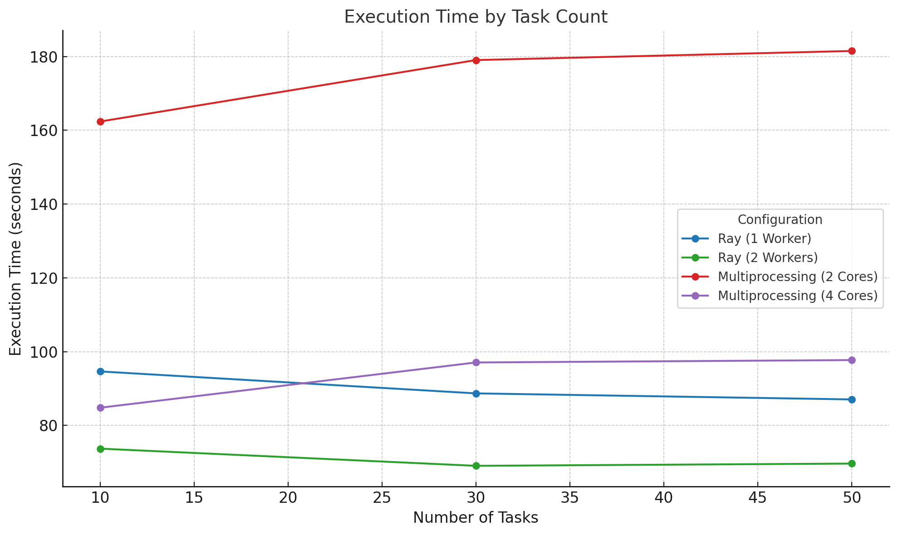

# 📈 Ray vs Multiprocessing 성능 비교 보고서

## 📝 개요

본 보고서는 분산 처리 프레임워크인 **Ray**와 표준 Python의 **Multiprocessing** 모듈을 활용하여 동일한 이미지 처리 작업을 수행했을 때의 **성능(처리 시간 및 메모리 사용량)**을 비교 분석한 문서입니다. 

성능 측정은 다양한 **작업 수(task 수)**와 **할당 리소스(Core 및 Memory)** 조건 하에서 실행되었으며, 각 환경은 Docker 컨테이너 기반으로 일관되게 구성되었습니다.

---

## ⚙️ 테스트 구성 및 코드 설명

### 📌 테스트 목적

본 테스트는 **대용량 이미지 처리**와 같은 CPU 집약적인 연산을 실제로 분산하거나 병렬 처리했을 때, **실제 환경에서 어떤 성능 차이가 발생하는지 확인**하기 위해 설계되었습니다.

주요 관심사는 다음과 같습니다:

- 동일한 작업량에 대해 Ray와 Multiprocessing의 **실행 시간 차이**
- 리소스 변화에 따른 **확장성 및 메모리 효율성 비교**

---

### 🧪 테스트 방식 및 구현 상세

테스트는 각각 **Ray 기반 분산 처리**와 **Python Multiprocessing 기반 병렬 처리**로 구현된 두 개의 스크립트로 구성되어 있습니다:

#### 1. Ray 기반 (`run_task_with_ray.py`)

- **Ray 클러스터 연결** 후 `@ray.remote` 데코레이터가 적용된 함수 `process_image`를 각 작업에 병렬로 분산 실행
- 각 이미지에 대해 다음과 같은 처리 수행:
  - **가우시안 블러 필터링**을 직접 구현한 커널 기반 컨볼루션
  - **이미지 밝기 조정**
  - **히스토그램 평활화 (채널별)**
- `ray.get()`을 통해 모든 작업 결과를 수집하고, 실행 시간과 메모리 사용량을 측정

#### 2. Multiprocessing 기반 (`run_task_with_mp.py`)

- Python의 `multiprocessing.Pool`을 활용하여 `process_image` 함수 병렬 실행
- 내부 처리 방식은 Ray와 동일: 컨볼루션 + 밝기 조정 + 히스토그램 평활화
- Pool은 **task 수와 동일한 프로세스 수**로 초기화되어 병렬 작업 수행

---

### ⚙️ 공통 설정 및 측정 방식

- **입력 데이터 크기**: 100MB 분량 이미지 데이터를 task 수에 따라 분할 생성
- **복잡도(complexity)**: 컨볼루션 연산의 크기를 결정 (kernel size = 5 × complexity)
- **측정 지표**:
  - **Execution Time (s)**: `time.time()` 기반 측정
  - **Memory Used (MB)**: `psutil.Process(...).memory_info().rss`를 통해 RSS 기준 측정

---

### 🧪 리소스 및 실행 환경

- 각 테스트는 **Docker 컨테이너** 내부에서 실행되었으며, 다음과 같이 리소스를 제한하여 성능 차이를 측정함:

| 환경 | 설정 |
|------|------|
| **Ray 테스트** | Head Node: 1core, 4GB RAM   Worker Node: 1~2core, 1GB RAM |
| **Multiprocessing 테스트** | 2core 또는 4core / 6GB RAM 환경 |
| 실행 명령어 예시 | `docker run --rm -m 6g --cpus=2 mp-benchmark-test` |

---

## 📊 테스트 결과

| 테스트 환경 | Task 수 | 실행 시간 (s) | 메모리 사용 (MB) |
|-------------|---------|----------------|------------------|
| **Ray: 1 Worker** (1core, 1G) | 10 | 94.64 | 35.08 |
| | 30 | 88.69 | 2.24 |
| | 50 | 87.05 | 4.37 |
| **Ray: 2 Worker** (각 1core, 1G) | 10 | 73.71 | 32.01 |
| | 30 | 69.05 | 1.71 |
| | 50 | 69.66 | 2.80 |
| **Multiprocessing: 2core** | 10 | 162.39 | 21.45 |
| | 30 | 179.05 | 29.60 |
| | 50 | 181.52 | 23.30 |
| **Multiprocessing: 4core** | 10 | 84.80 | 22.34 |
| | 30 | 97.07 | 29.57 |
| | 50 | 97.72 | 17.66 |

---

## 📊 Visualization
ray worker 는 node 당 1core, 1G memory 사용

---

## 🔍 성능 분석

### 🚀 실행 시간

- **Ray_2 Worker 구성**은 전 구간에서 가장 빠른 성능을 보였으며, 작업 수가 증가할수록 효과적인 분산 처리로 시간 단축이 명확히 확인됨
- **Multiprocessing_2core**는 모든 실험에서 가장 느린 성능을 보여 병렬 확장에 제약이 있음
- **Multiprocessing_4core** 구성은 단일 머신 기반으로 일정 수준의 개선을 보였지만, 여전히 Ray 대비 낮은 성능

### 💾 메모리 사용량

- **Ray**는 Worker 수가 늘어나더라도 전체 메모리 사용량은 낮은 수준으로 유지
- **Multiprocessing**은 메모리 사용량의 예측 가능성이 낮으며, Task 수에 따라 비일관적인 사용량을 보임

==> 테스트 마치고 생각해보면 메모리 사용량은 의미 없는 데이터가 아닌가 생각했음 -> 현재 Task , multi process 에서 동작하는 작업은 
메모리를 많이 사용하는 작업이 아닌 처리작업이 **Main**이기 때문에

---

## 🧠 결론

- **Ray는 분산 처리에 최적화되어 있으며**, task 수가 많아질수록 효율성과 성능 측면에서 우수함
- **Multiprocessing은 간단한 환경에서 구현은 용이하지만**, 리소스의 제한이 명확하고 성능 확장에 한계가 존재
- 대규모 이미지 처리, 과학 계산, 대용량 로그 처리 등의 **병렬처리 성능이 중요한 서비스**에는 Ray가 명확한 우위

---

